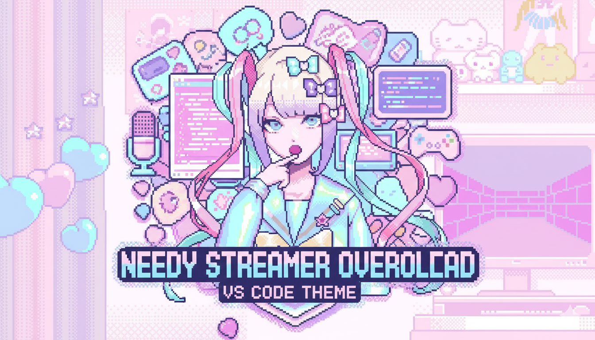
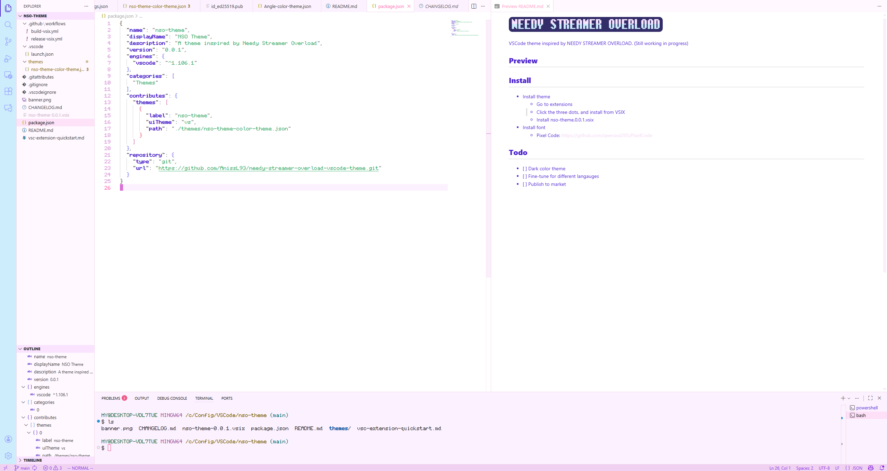

- VSCode theme inspired by NEEDY STREAMER OVERLOAD (https://whysoserious.jp/needy/en/).  
- Still working in progress

## Preview

## Install

- Install theme
    - Download .vsix file from the release page
    - Go to extensions
    - Click the three dots, and install from VSIX 
    - Install nso-theme.0.0.1.vsix
- Install font
    - Pixel Code: https://github.com/qwerasd205/PixelCode

## Todo
- [ ] Dark color theme
- [ ] Fine-tune for different langauges 
- [ ] Publish to market

## Thanks
- Gemini: For generating the images

